# Simple 8 Bit Computer

#### [Link To Video](https://www.youtube.com/watch?v=bzLV9FmAsYg)

- 8 bit CPU architecture
- 16 different instructions based on the suitability of our
- Our computer has a 4-bit opcode, 4-bit address length.
- A memory of 16x8.
- Eight registers: IR, PC, A, B, OR, MBR, MAR and SC.
- Binary to 7 Segment converter
- An 8-bit internal Bus.
- 4-bit and 8-bit External Bus.

# Chapter 1: INTRODUCTION

I have implemented 16 different instructions based on
the suitability of our project. Our computer has a 4-bit opcode, 4-bit
address length. With that being said, our computer “Quintuple-A”
consists of the following hardware components:

1. A memory of 16x8.

2. Eight registers: IR, PC, A, B, OR, MBR, MAR
   and SC.

3. Binary to 7 Segment converter 

4. An 8-bit internal Bus.

5. 4-bit and 8-bit External Bus.

6. Control Unit Design using Logisim combinational
analysis

7. ALU that supports adding, subtracting, XOR, AND, OR
etc

---

# Chapter 2: Design Considerations

## 2.1. INSTRUCTION FORMAT

There are two parts an instruction can be divided into.
They are:

Operation Code (Opcode): It
specifies the operation for an instruction.

Address: It specifies the
registers and/or locations in memory to use for a particular

Operation

 An 8 bit computer by design should have a word size of
8 bits. Memory address register, which is responsible for storing RAM
addresses, is 4 bit.  so the size of RAM is 2^4 = 16 bytes only. 

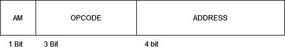

Figure 1: Instruction Format

## 2.2. ADDRESSING MODES

Immediate Addressing

The address of the operand is loaded directly into the
A register in immediate addressing mode. One of the example of immediate
addressing is given in the figure below.

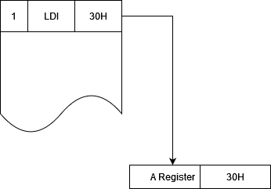

Figure 2: Immediate Addressing

Direct Addressing

The address of the operand is stored in the memory
location specified in the instruction in the direct addressing
mode

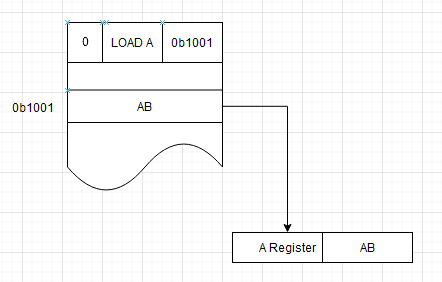

Figure 3: Direct Addressing mode

## 2.3. INSTRUCTION SET

Since I allocated 4 bits for opcode, only 16 total instructions are
possible. However I wanted to make this computer as simple as possible
so I only added 24 =16 total
instructions. Furthermore among those 16 instructions 8 of them has been
divided into register. Below is the table that shows Register reference
operations and memory reference instructions

Register Reference Instruction

Register reference instruction work with registers
only

<table class="c44">
<tbody>
<tr class="odd c22">
<td class="c36">
Opcode 
</td>
<td class="c72">
Instruction
</td>
<td class="c47">
Description
</td>
</tr>
<tr class="even c22">
<td class="c36">
1011
</td>
<td class="c72">
CLEAR
</td>
<td class="c47">
Set OR to 0
</td>
</tr>
<tr class="odd c22">
<td class="c36">
1100
</td>
<td class="c72">
INC 
</td>
<td class="c47">
Increment Output
Register
</td>
</tr>
<tr class="even c22">
<td class="c36">
1101
</td>
<td class="c72">
COMPLEMENT
</td>
<td class="c47">
Complement Output
Register
</td>
</tr>
<tr class="odd c22">
<td class="c36">
1110
</td>
<td class="c72">
SHL 
</td>
<td class="c47">
 Shift Left Output
Register
</td>
</tr>
<tr class="even c22">
<td class="c36">
1111
</td>
<td class="c72">
SHR
</td>
<td class="c47">
Shift Right Output
Register
</td>
</tr>
<tr class="odd c22">
<td class="c36">
1000
</td>
<td class="c72">
SWAP
</td>
<td class="c47">
SWAP Register A and B
Values
</td>
</tr>
</tbody>
</table>

Table 1: Register Reference Instruction

---

## 2.4. MEMORY REFERENCE INSTRUCTIONS

Memory reference instructions load values into and
store values from the general registers. 

<table class="c44">
<tbody>
<tr class="odd c22">
<td class="c36">
Opcode 
</td>
<td class="c4">
Instruction
</td>
<td class="c53">
Description
</td>
</tr>
<tr class="even c22">
<td class="c36">
0000
</td>
<td class="c4">
LOAD A, [M]
</td>
<td class="c53">
Load the contents of M into A
Register
</td>
</tr>
<tr class="odd c22">
<td class="c36">
0001
</td>
<td class="c4">
LOAD B, [M]
</td>
<td class="c53">
Load the contents of M into B
Register
</td>
</tr>
<tr class="even c22">
<td class="c36">
1001
</td>
<td class="c4">
LDI A, M
</td>
<td class="c53">
Load content M into A
register
</td>
</tr>
<tr class="odd c22">
<td class="c36">
1010
</td>
<td class="c4">
LDI B, M
</td>
<td class="c53">
Load content M into B
register
</td>
</tr>
<tr class="even c54">
<td class="c36">
0010
</td>
<td class="c4">
ADD 
</td>
<td class="c53">
Add A and B
</td>
</tr>
<tr class="odd c22">
<td class="c36">
0011
</td>
<td class="c4">
STORE [M]
</td>
<td class="c53">
Store the contents of output
Register to given memory location
</td>
</tr>
<tr class="even c22">
<td class="c36">
0100
</td>
<td class="c4">
SUB
</td>
<td class="c53">
Subtract A and B
</td>
</tr>
<tr class="odd c22">
<td class="c36">
0101
</td>
<td class="c4">
XOR
</td>
<td class="c53">
XOR operation on A and
B
</td>
</tr>
<tr class="even c22">
<td class="c36">
0110
</td>
<td class="c4">
AND
</td>
<td class="c53">
AND operation on A and
B
</td>
</tr>
<tr class="odd c22">
<td class="c36">
0111
</td>
<td class="c4">
OR
</td>
<td class="c53">
OR operation on A and
B
</td>
</tr>
</tbody>
</table>

Table 2: Memory Reference Instruction

---

# Chapter 3: DESIGN OF INDIVIDUAL COMPONENT

## 3.1. REGISTER

A single bit can be persisted using D Flip flop.
Furthermore these 8 cells make up a 8-bit register. Since D flip flop
doesn’t have input pins for control like WE, Din. I can add it using a
combination of AND, OR gates and controlled Buffer.

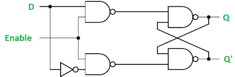

Figure 4: A D-Flip Flop

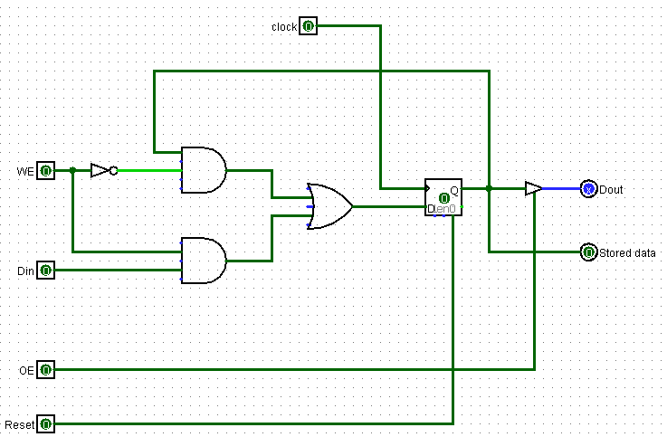

Figure 5: Memory Cell

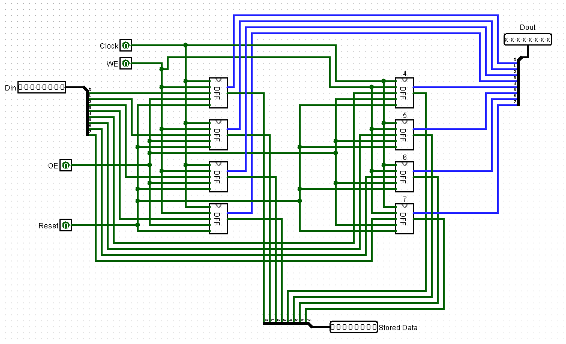

Figure 6: 8 bit Register built using Memory
cells

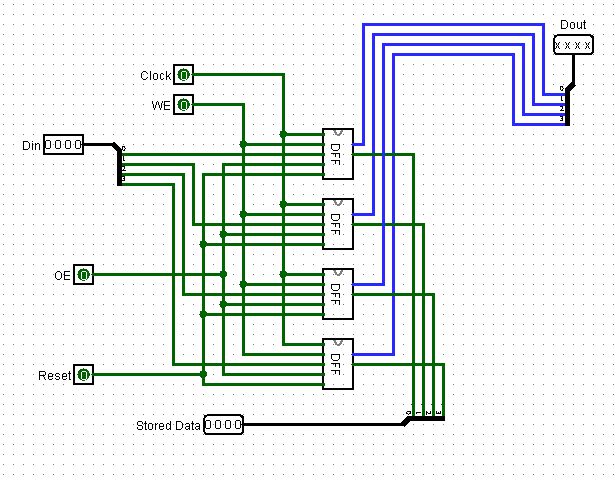

Figure 7: 4 Bit Memory Address Register

Our Computer consists of 8 Registers. They are as
follows

Instruction Register (IR)

Size: 8 bits

IR stores the 8 bits of instruction read from the
memory. At the start of each instruction cycle, the address contained in
the PC is transferred to the MAR, and the content of the memory location
pointer by MAR is then transferred to the IR through the internal bus
system (IBS). Once the instruction is loaded in the IR, Opcode is
selected with Binary selector by Control Unit and if opcode requires
address to be loaded then the address line is selected and sent to
MAR.

---

Program Counter (PC)

Size: 3 Bits

The program counter contains the address of the memory
location where the next instruction is located. At the beginning of each
instruction cycle (fetch), the content of the program counter is
transferred to MAR and then is incremented by one to point to the next
consecutive location.

Memory Address Register (MAR)

Size: 4 bits

It contains main memory addresses of data and
instructions. It holds the memory location of data that needs to be
accessed

Memory Buffer Register (MBR)

Size: 8 bits

MBR acts as a buffer between RAM and other Registers.
When loading something into the instruction register, the contents gets
loaded into MBR first then only into IR through the internal bus. When
something needs to be written into RAM then content to be loaded is
first placed on MBR then written to RAM

Output Register (OR)

Size: 8 bits

It stores the output value of ALU. 

A Register 

Size: 8 bits

This is one of the registers readily available to
programmers and where data can be loaded so that ALU can interface it
with.

---

B Register

Size: 8 bits

This is one of the registers readily available to
programmers and where data can be loaded so that ALU can interface it
with.

Sequence Counter (SC)

Size: 3 bits

Sequence Counter is incremented with respect to clock
cycle and resets when instruction is finished or halted. 

---

## 3.2. COUNTER

Ripple counter is a cascaded arrangement of
flip-flops where the output of one flip-flop drives the clock input of
the following flip-flop. The number of flip flops in the cascaded
arrangement depends upon the number of different logic states that it
goes through before it repeats the sequence. A n-bit ripple counter can
count up to 2n states

Figure 8: Ripple Counter that works on Falling
edge

Instead of using a clock pulse I can use the same input
to increment the counter if count-enable is set to high. The cascaded
arrangement allows one counter to activate another. 

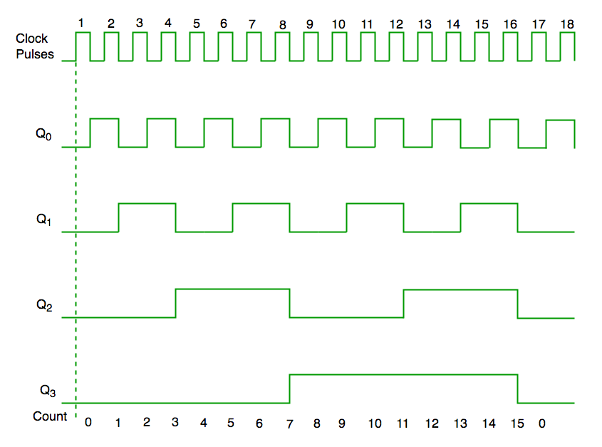

Figure 9: Waveform of ripple counter

3.3. MEMORY UNIT

Size: 16x8

The memory size 16x8 indicates there are 16 different slots where 8 bits
of instruction can be stored and executed in each slot. Memory stores
both the instruction and the data on which processing is to be
performed.  To address 16 different slots
log2(16) = 4-bit address line
is needed. 

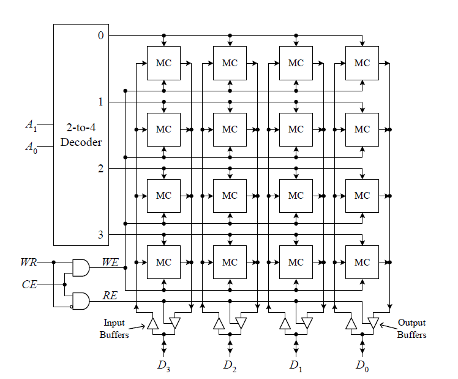

Figure 10: Block diagram for 4x4 sized RAM

Half of the ram is to be used for instruction and half
of it is to be used for data. 

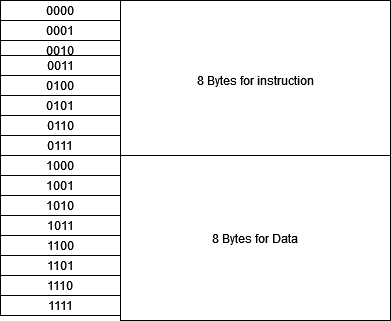

Figure 11: Memory unit division into Instruction and
Data

Note: it is just a convention

---

## 3.3. PROGRAMMING 7 SEGMENT DISPLAY

For the output the best way to show the results is in
the Decimal system. I have a register size of 8 bits which means 2^8-1
is the largest number I have to compute for. Logisim has a ROM device
which can load hex values from the external file. To map binary number
to equivalent decimal representation following hex table was used

<table class="c44">
<tbody>
<tr class="odd c22">
<td class="c64">
Decimal
</td>
<td class="c61">
Binary
</td>
<td class="c65">
Seven Segment
Display
</td>
</tr>
<tr class="even c22">
<td class="c64">
0
</td>
<td class="c61">
0000
</td>
<td class="c65">
11100111
</td>
</tr>
<tr class="odd c22">
<td class="c64">
1
</td>
<td class="c61">
0001
</td>
<td class="c65">
0010001
</td>
</tr>
<tr class="even c22">
<td class="c64">
2
</td>
<td class="c61">
0010
</td>
<td class="c65">
11001011
</td>
</tr>
<tr class="odd c22">
<td class="c64">
3
</td>
<td class="c61">
0011
</td>
<td class="c65">
01101011
</td>
</tr>
<tr class="even c22">
<td class="c64">
4
</td>
<td class="c61">
0100
</td>
<td class="c65">
00101101
</td>
</tr>
<tr class="odd c22">
<td class="c64">
5
</td>
<td class="c61">
0101
</td>
<td class="c65">
01101110
</td>
</tr>
<tr class="even c22">
<td class="c64">
6
</td>
<td class="c61">
0110
</td>
<td class="c65">
11101110
</td>
</tr>
<tr class="odd c22">
<td class="c64">
7
</td>
<td class="c61">
0111
</td>
<td class="c65">
00010001
</td>
</tr>
<tr class="even c22">
<td class="c64">
8
</td>
<td class="c61">
1000
</td>
<td class="c65">
11110111
</td>
</tr>
<tr class="odd c22">
<td class="c64">
9
</td>
<td class="c61">
1001
</td>
<td class="c65">
11011111
</td>
</tr>
</tbody>
</table>

Table 3: Decimal Binary and its equivalent Seven
segment Display Code

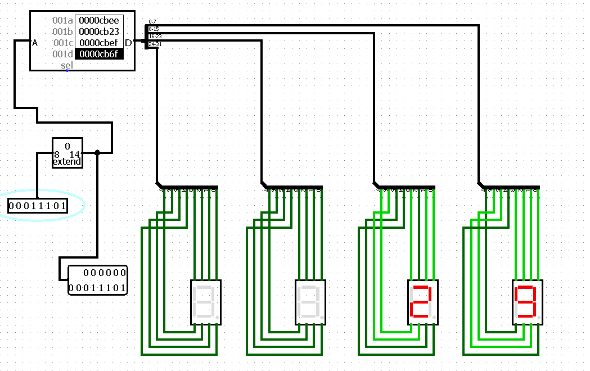

Figure 12: Binary to 7 segment converter.

Circuit takes 00011101 as input and shows 29 as output.
Binary to Decimal Conversion using ROM. To convert binary to seven
segment displayable values. Each binary value that is addressable on ROM
has a corresponding 7 segment values placed on it which means if i
address 100 then the output will be 00101101 which shows 4 on a seven
segment display. To program the data to be loaded on ROM, a very simple
approach is used. 

If number is 652 then first it is divided into its
corresponding digits and stored in unsigned 32 bit storage

652 MOD 10 = 2 = 11001011 

65 MOD 10 = 5 = 01101110

6 MOD 10 = 6 = 11101110 

11001011 &lt;&lt; 0 = 00000000 00000000 00000000
11001011

01101110 &lt;&lt; 8 = 00000000 00000000 01101110
 00000000

11101110 &lt;&lt; 16 = 00000000 11101110 00000000
00000000

Then these numbers are added.

Code used to convert Binary to Seven Segment Display
Values in Rust is:

use std::fs::File;

use std::io::Write;

use std::fs::OpenOptions;

use std::io::prelude::\*;

fn main() {

   
let mut file = OpenOptions::new().write(true).create(true).open("seven-segment-rom").expect("couldn't");

   
writeln!(&mut file,"v2.0
raw");

    // 0 -&gt; 11100111

   
let segment\_values : \[u8; 10\] = \[0b11100111, 0b00100001, 0b11001011, 0b01101011, 0b00101101, 0b01101110, 0b11101110, 0b00100011, 0b11101111, 0b01101111\];

   
for i in 0..=255 {

       
let mut shift\_counter = 0;

       
let mut buffer\_value : u32= 0;

       
let mut temp\_i = i;

       
if i == 0 {

           
write!(&mut file,"{:x} ", segment\_values\[i\] as u32);

           
continue;

        }

       
while temp\_i &gt; 0 {

           
let digit = temp\_i % 10;

           
buffer\_value += (segment\_values\[digit\] as u32) &lt;&lt; (8 \* shift\_counter);

           
shift\_counter += 1;

           
temp\_i /= 10;

        }

       
write!(&mut file,"{:x} ", buffer\_value);

       
if (i+1) % 8 == 0 {

           
writeln!(&mut file, "");

        }

    }

}

---

## 3.4. ARITHMETIC AND LOGICAL UNIT (ALU)

The arithmetic and logic unit in our computer performs
arithmetic and logical operations. The design procedure starts with
building a full adder which has 2 AND gates, 2 XOR gates and 1 OR
gate.

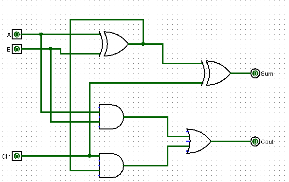

Figure 13: Full adder

Full adder works only for one bit. Since our computer
is 8 bits I have to extend the full adder and add two 8-bit input pins
and one 8-bit output pins. 

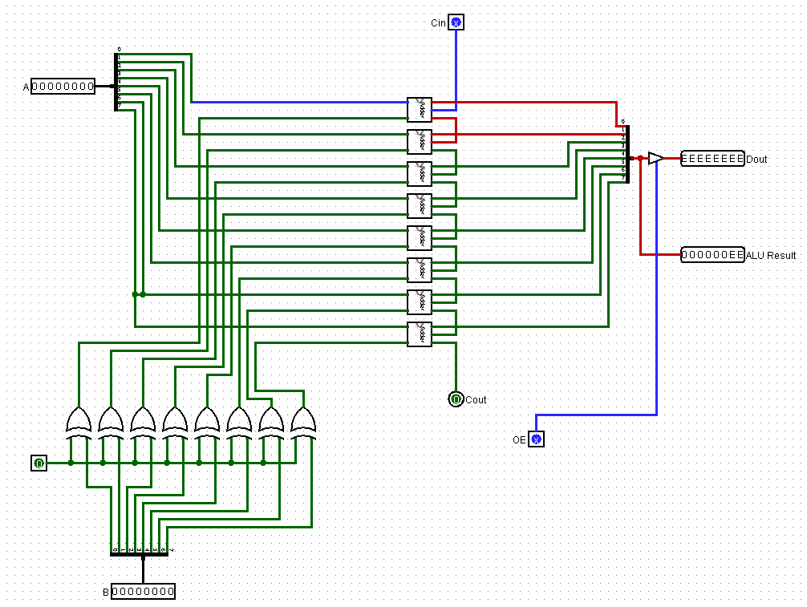

Figure 14: 8 Bit Adder

Instruction set supports not only adding but
subtracting, ANDing, XORing and ORing also. To support subtraction, I
can complement one of the registers and add one to the result. Addition
and subtraction can have the same line which can be enabled if the ADD
input line or SUB input line is high. For other operations each of them
can have their own line and can be activated in a similar way. 

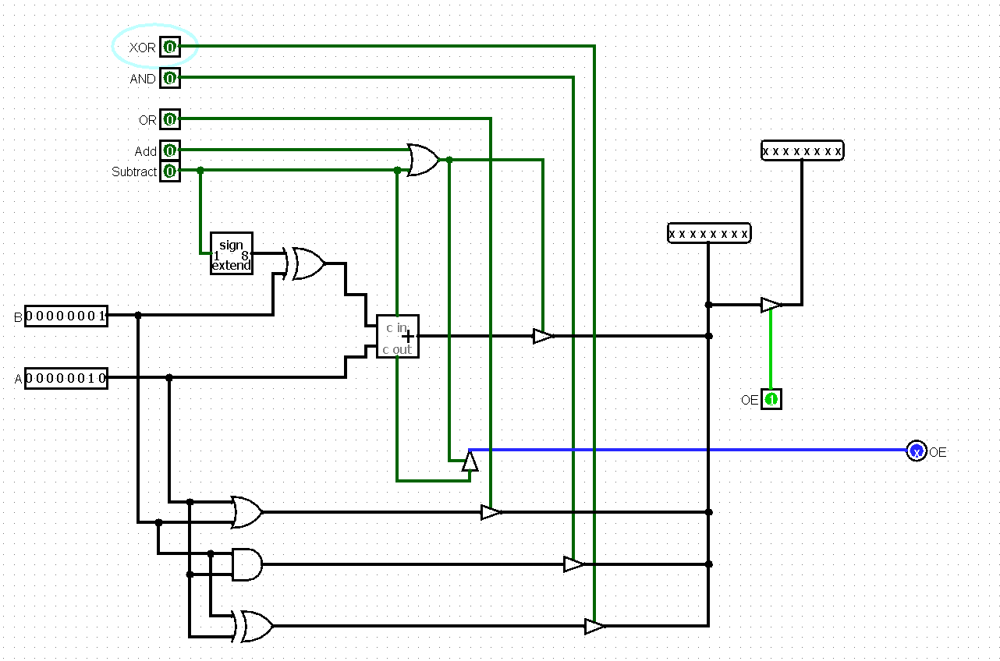

Figure 15: Adder, Subtractor, XORer, ANDer and
ORer.

## 3.5. CONTROL UNIT

Control unit is implemented by using the Logisim
combinational analysis tool. First input signals given by IR(Instruction
Register) for opcode OPC0, OPC1, OPC2 and OPC3 with the input signal
given by sequence counter are added. Then for timing and control
Sequence counter pins SC0, SC1, and SC2 are added. The output pins
C0..C27 with description is present on the table below

C0

PC OUTPUT ENABLE

C1

PC COUNT ENABLE

C2 

RAM WRITE ENABLE

C3

RAM OUTPUT ENABLE

C4

MBR WRITE ENABLE

C5

MBR INTERNAL BUS ENABLE

C6

MBR OUTPUT ENABLE

C7

IR WRITE ENABLE

C8

IR OUTPUT ENABLE

C9

MAR WRITE ENABLE

C10

MAR OUTPUT ENABLE

C11

ALU OUTPUT ENABLE

C12

REGISTER A WRITE ENABLE

C13

REGISTER B WRITE ENABLE

C14

OUTPUT REGISTER OUTPUT ENABLE

C15

OUTPUT REGISTER WRITE ENABLE

C16

ALU SUBTRACT MODE 

C17

ALU XOR MODE

C18

ALU AND MODE

C19

ALU OR MODE

C20

REGISTER A OUTPUT ENABLE

C21

REGISTER B OUTPUT ENABLE

C22

 RESET FOR OUTPUT REGISTER (OR)

C23

COMPLEMENT FOR OUTPUT REGISTER(OR)

C24

SHIFT RIGHT ENABLE FOR OUTPUT REGISTER 

C25

SHIFT LEFT ENABLE FOR OUTPUT REGISTER

C26

INC FOR OUTPUT REGISTER

C27

IMMEDIATE LOAD ENABLE(ILE) PIN ENABLE

Table 4: Control Unit

---

## 3.6. BUS SYSTEM AND OVERALL ARCHITECTURE

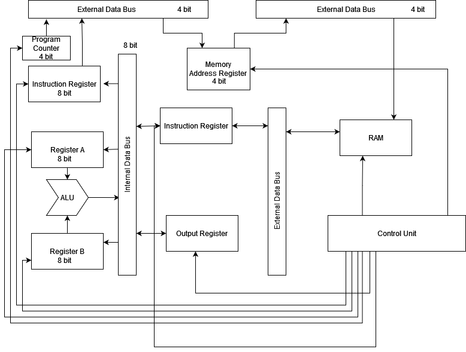

Figure 16: Computer Architecture

---

## 3.7. INSTRUCTION SET DESIGN

INITIAL OPERATION

A computer can understand and execute a few numbers of
instructions that are hardwired in its design, these instructions form
the instruction set of the computer.

The selection of binary code for the instruction and
the instruction itself is the main task of the computer designer.

A machine instruction is executed in the following
cycle

Fetch Cycle: Here, the
instruction is fetched from the memory.

Decode Cycle: After fetching
the instructions, they are decoded in this cycle.

This mainly happens in the T2 cycle. Here, the decision
is taken such that the

instructions are sent accordingly to the respective
addressing modes.

Execution Cycle: Once, the
decision of sending to the addressing modes are

taken, the instructions are finally executed in this
phase.

<table class="c44">
<colgroup>
<col style="width: 33%" />
<col style="width: 33%" />
<col style="width: 33%" />
</colgroup>
<tbody>
<tr class="odd c7">
<td colspan="3" class="c75">
Fetch Decode and Execute
Cycle
</td>
</tr>
<tr class="even c22">
<td class="c41">
Step Counter
</td>
<td class="c11">
Operation to perform
</td>
<td class="c18">
RTL
</td>
</tr>
<tr class="odd c23">
<td rowspan="2" class="c41">
T0 = 000

</td>
<td class="c11">
Activate OE of PC
</td>
<td rowspan="2" class="c18">
C0.C9 : MAR &lt;-
PC

</td>
</tr>
<tr class="even c7">
<td class="c11">
Activate I of MAR
</td>
</tr>
<tr class="odd c7">
<td rowspan="4" class="c41">
T1 = 001

</td>
<td class="c11">
Activate OE of MAR
</td>
<td rowspan="4" class="c18">
C1.C3.C4.C10 : MBR &lt;-
[MAR], PC &lt;- PC + 1
</td>
</tr>
<tr class="even c7">
<td class="c11">
Activate OE of RAM
</td>
</tr>
<tr class="odd c7">
<td class="c11">
  Activate I of MBR
</td>
</tr>
<tr class="even c7">
<td class="c11">
Activate CE of PC
</td>
</tr>
<tr class="odd c7">
<td rowspan="2" class="c41">
T2 = 010
</td>
<td class="c11">
Activate Internal OE of
MBR
</td>
<td rowspan="2" class="c18">
C5.C7 : IR &lt;-
MBR
</td>
</tr>
<tr class="even c7">
<td class="c11">
Activate I of IR
</td>
</tr>
</tbody>
</table>

ADD OPERATION

<table class="c44">
<colgroup>
<col style="width: 33%" />
<col style="width: 33%" />
<col style="width: 33%" />
</colgroup>
<tbody>
<tr class="odd c22">
<td class="c41">
Step Counter
</td>
<td class="c11">
Operation to perform
</td>
<td class="c18">
RTL
</td>
</tr>
<tr class="even c7">
<td rowspan="2" class="c41">
T3 = 011
</td>
<td rowspan="2" class="c11">
Activate OE of
ALU

Activate I of Output Register
</td>
<td rowspan="2" class="c18">
C15.C11: ALU &lt;- A +
B,

OR &lt;- ALU

</td>
</tr>
<tr class="odd c7">
</tr>
</tbody>
</table>

SUBTRACT OPERATION

<table class="c44">
<colgroup>
<col style="width: 33%" />
<col style="width: 33%" />
<col style="width: 33%" />
</colgroup>
<tbody>
<tr class="odd c22">
<td class="c41">
Step Counter
</td>
<td class="c11">
Operation to perform
</td>
<td class="c18">
RTL
</td>
</tr>
<tr class="even c7">
<td rowspan="2" class="c41">
T3 = 011
</td>
<td rowspan="2" class="c11">
Activate OE of
ALU
</td>
<td rowspan="2" class="c18">
C15.C11.C16: ALU &lt;- A
- B,

OR &lt;- ALU

</td>
</tr>
<tr class="odd c7">
</tr>
</tbody>
</table>

---

XOR OPERATION

<table class="c44">
<colgroup>
<col style="width: 33%" />
<col style="width: 33%" />
<col style="width: 33%" />
</colgroup>
<tbody>
<tr class="odd c22">
<td class="c41">
Step Counter
</td>
<td class="c11">
Operation to perform
</td>
<td class="c18">
RTL
</td>
</tr>
<tr class="even c7">
<td rowspan="2" class="c41">
T3
</td>
<td rowspan="2" class="c11">
Activate OE of
ALU
</td>
<td rowspan="2" class="c18">
C15.C11.C17: ALU &lt;- A
XOR B,

OR &lt;- ALU

</td>
</tr>
<tr class="odd c7">
</tr>
</tbody>
</table>

AND OPERATION

<table class="c44">
<colgroup>
<col style="width: 33%" />
<col style="width: 33%" />
<col style="width: 33%" />
</colgroup>
<tbody>
<tr class="odd c22">
<td class="c41">
Step Counter
</td>
<td class="c11">
Operation to perform
</td>
<td class="c18">
RTL
</td>
</tr>
<tr class="even c7">
<td rowspan="2" class="c41">
T3
</td>
<td rowspan="2" class="c11">
Activate OE of
ALU
</td>
<td rowspan="2" class="c18">
C15.C11.C18: ALU &lt;- A
AND B,

OR &lt;- ALU

</td>
</tr>
<tr class="odd c7">
</tr>
</tbody>
</table>

SWAP REGISTER VALUES

<table class="c44">
<colgroup>
<col style="width: 33%" />
<col style="width: 33%" />
<col style="width: 33%" />
</colgroup>
<tbody>
<tr class="odd c60">
<td class="c41">
Step Counter
</td>
<td class="c11">
Operation to perform
</td>
<td class="c18">
RTL
</td>
</tr>
<tr class="even c7">
<td rowspan="2" class="c41">
T3
</td>
<td class="c11">
Activate OE of Register
A
</td>
<td rowspan="2" class="c18">

C20.C15: OR &lt;- A
</td>
</tr>
<tr class="odd c22">
<td class="c11">
Activate WR of OR
</td>
</tr>
<tr class="even c7">
<td rowspan="2" class="c41">
T4
</td>
<td class="c11">
Activate WR of Register
A
</td>
<td rowspan="2" class="c18">
C12.C21 : A &lt;-
B
</td>
</tr>
<tr class="odd c7">
<td class="c11">
Activate OE of Register
B
</td>
</tr>
<tr class="even c7">
<td rowspan="2" class="c41">
T5
</td>
<td class="c11">
Activate WR of Register
B
</td>
<td rowspan="2" class="c18">
 C13.C14 : B &lt;-
OR
</td>
</tr>
<tr class="odd c7">
<td class="c11">
Activate OE of OR 
</td>
</tr>
</tbody>
</table>

LOAD A

<table class="c44">
<colgroup>
<col style="width: 33%" />
<col style="width: 33%" />
<col style="width: 33%" />
</colgroup>
<tbody>
<tr class="odd c22">
<td class="c41">
Step Counter
</td>
<td class="c11">
Operation to perform
</td>
<td class="c18">
RTL
</td>
</tr>
<tr class="even c7">
<td rowspan="2" class="c41">
T3
</td>
<td class="c11">
Activate OE of IR
</td>
<td rowspan="2" class="c18">
C8.C9 : MAR &lt;-
IR(4-7)

</td>
</tr>
<tr class="odd c7">
<td class="c11">
Activate I of MAR
</td>
</tr>
<tr class="even c71">
<td rowspan="3" class="c41">
T4
</td>
<td class="c11">
Activate OE of MAR
</td>
<td rowspan="3" class="c18">
C3.C4.C10: MBR &lt;-
[MAR]
</td>
</tr>
<tr class="odd c7">
<td class="c11">
Activate OE of RAM
</td>
</tr>
<tr class="even c7">
<td class="c11">
Activate I of MBR
</td>
</tr>
<tr class="odd c7">
<td rowspan="2" class="c41">
T5
</td>
<td class="c11">
Activate internal OE of
MBR
</td>
<td rowspan="2" class="c18">
C5.C12: A &lt;-
MBR
</td>
</tr>
<tr class="even c7">
<td class="c11">
Activate I of Reg. A
</td>
</tr>
</tbody>
</table>

LOAD TO B

<table class="c44">
<colgroup>
<col style="width: 33%" />
<col style="width: 33%" />
<col style="width: 33%" />
</colgroup>
<tbody>
<tr class="odd c22">
<td class="c41">
Step Counter
</td>
<td class="c11">
Operation to perform
</td>
<td class="c18">
RTL
</td>
</tr>
<tr class="even c7">
<td rowspan="2" class="c41">
T3
</td>
<td class="c11">
Activate OE of IR
</td>
<td rowspan="2" class="c18">
C8.C9 : MAR &lt;-
IR(4-7)

</td>
</tr>
<tr class="odd c7">
<td class="c11">
Activate I of MAR
</td>
</tr>
<tr class="even c71">
<td rowspan="3" class="c41">
T4
</td>
<td class="c11">
Activate OE of MAR
</td>
<td rowspan="3" class="c18">
C3.C4.C10: MBR &lt;-
[MAR]
</td>
</tr>
<tr class="odd c7">
<td class="c11">
Activate OE of RAM
</td>
</tr>
<tr class="even c7">
<td class="c11">
Activate I of MBR
</td>
</tr>
<tr class="odd c7">
<td rowspan="2" class="c41">
T5
</td>
<td class="c11">
Activate internal OE of
MBR
</td>
<td rowspan="2" class="c18">
C5.C13: B &lt;-
MBR
</td>
</tr>
<tr class="even c7">
<td class="c11">
Activate I of Reg. A
</td>
</tr>
</tbody>
</table>

STORE 

<table class="c44">
<colgroup>
<col style="width: 33%" />
<col style="width: 33%" />
<col style="width: 33%" />
</colgroup>
<tbody>
<tr class="odd c22">
<td class="c41">
Step Counter
</td>
<td class="c11">
Operation to perform
</td>
<td class="c18">
RTL
</td>
</tr>
<tr class="even c7">
<td rowspan="2" class="c41">
T3
</td>
<td class="c11">
Activate OE of IR
</td>
<td rowspan="2" class="c18">
C8.C9: MAR &lt;-
IR(4-7)

</td>
</tr>
<tr class="odd c7">
<td class="c11">
Activate I of MAR
</td>
</tr>
<tr class="even c63">
<td rowspan="2" class="c41">
T4
</td>
<td class="c11">
Activate I of MBR
</td>
<td rowspan="2" class="c18">
C4.C14: MBR &lt;- OR,
RAM &lt;- OR
</td>
</tr>
<tr class="odd c63">
<td class="c11">
Activate OE of Output
Register
</td>
</tr>
<tr class="even c63">
<td rowspan="3" class="c41">
T5
</td>
<td class="c11">
Activate OE of MAR
</td>
<td rowspan="3" class="c18">
C10.C2.C6: [MAR] &lt;-
MBR
</td>
</tr>
<tr class="odd c63">
<td class="c11">
Activate I of RAM
</td>
</tr>
<tr class="even c63">
<td class="c11">
Activate OE of MBR
</td>
</tr>
</tbody>
</table>

---

CLR

<table class="c44">
<colgroup>
<col style="width: 33%" />
<col style="width: 33%" />
<col style="width: 33%" />
</colgroup>
<tbody>
<tr class="odd c22">
<td class="c41">
Step Counter
</td>
<td class="c11">
Operation to perform
</td>
<td class="c18">
RTL
</td>
</tr>
<tr class="even c7">
<td class="c41">
T3 = 011

Sc0 =1 

Sc1 =1

sc2=0

Opc0 =1

Opc1 = 1

Opc2 = 0

Opc3 = 1

</td>
<td class="c11">
Activate Reset of 

Output Register

 
</td>
<td class="c18">
C22 : OR &lt;- 0

</td>
</tr>
</tbody>
</table>

INC

<table class="c44">
<colgroup>
<col style="width: 33%" />
<col style="width: 33%" />
<col style="width: 33%" />
</colgroup>
<tbody>
<tr class="odd c22">
<td class="c70">
Step Counter
</td>
<td class="c58">
Operation
</td>
<td class="c58">
RTL
</td>
</tr>
<tr class="even c78">
<td rowspan="2" class="c70">
T3
</td>
<td rowspan="2" class="c58">
Activate INC of
OR
</td>
<td rowspan="2" class="c58">
C26 : OR &lt;- OR +
1

</td>
</tr>
<tr class="odd c62">
</tr>
</tbody>
</table>

SHL 

<table class="c44">
<colgroup>
<col style="width: 33%" />
<col style="width: 33%" />
<col style="width: 33%" />
</colgroup>
<tbody>
<tr class="odd c22">
<td class="c70">
Step Counter
</td>
<td class="c58">
Operation
</td>
<td class="c58">
RTL
</td>
</tr>
<tr class="even c62">
<td rowspan="2" class="c70">
T3
</td>
<td rowspan="2" class="c58">
Activate SHL of
OR
</td>
<td rowspan="2" class="c58">
C25 : OR(0) &lt;- OR(1),
OR(1) &lt;- OR(2), OR(2) &lt;- OR(3), OR(3) &lt;- OR(4), OR(4) &lt;-
OR(5), OR(5) &lt;- OR(6), OR(6) &lt;- OR(7), OR(7) &lt;- OR(8), OR(8)
&lt;- 0 

</td>
</tr>
<tr class="odd c62">
</tr>
</tbody>
</table>

SHR

<table class="c44">
<colgroup>
<col style="width: 33%" />
<col style="width: 33%" />
<col style="width: 33%" />
</colgroup>
<tbody>
<tr class="odd c22">
<td class="c70">
Step Counter
</td>
<td class="c58">
Operation
</td>
<td class="c58">
RTL
</td>
</tr>
<tr class="even c62">
<td rowspan="2" class="c70">
T3
</td>
<td rowspan="2" class="c58">
Activate SHR of
OR
</td>
<td rowspan="2" class="c58">
C24 : OR(8) &lt;- OR(7),
OR(7) &lt;- OR(6), OR(6) &lt;- OR(5), OR(5) &lt;- OR(4), OR(4) &lt;-
OR(3), OR(3) &lt;- OR(2), OR(2) &lt;- OR(1), OR(1) &lt;- OR(0), OR(0)
&lt;- 0 

</td>
</tr>
<tr class="odd c62">
</tr>
</tbody>
</table>

## 

## 3.8. TIMING AND CONTROL

The timing for all registers in the computer is
controlled by a master clock generator. The clock pulses are applied to
all flip flops and registers in the system, including the flip flops and
registers in the control unit. The clock pulses do not change the state
of the register unless the register is enabled by a control signal. The
control signals are generated in the control unit and provide control
inputs for the multiplexers in the common bus, control inputs in the
processor register and micro-operations hardwired organization for the
accumulator

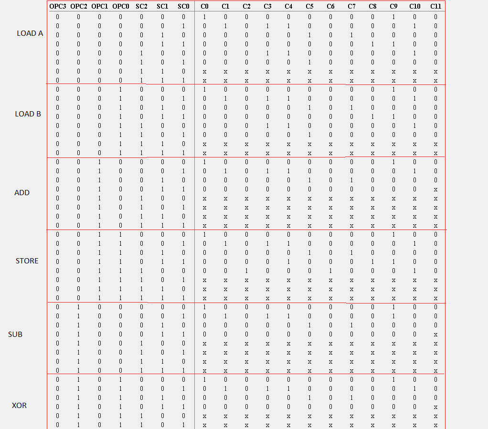

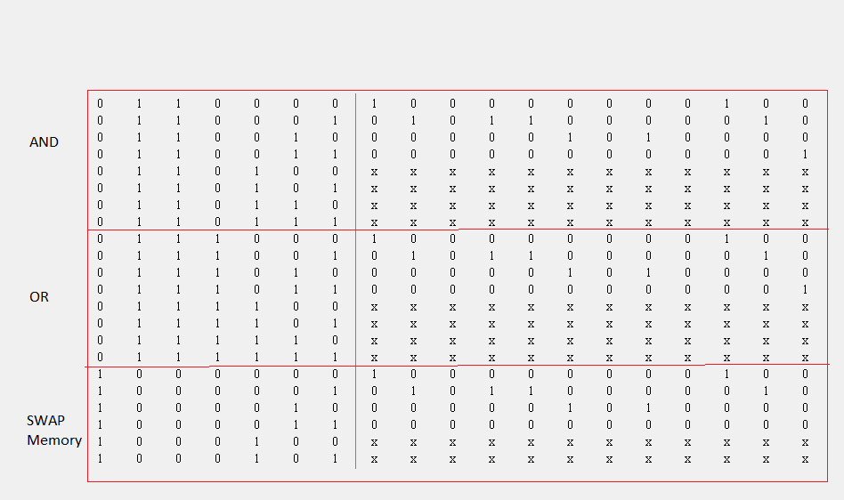

Table 5: Control Unit for the Output pin C1-C11

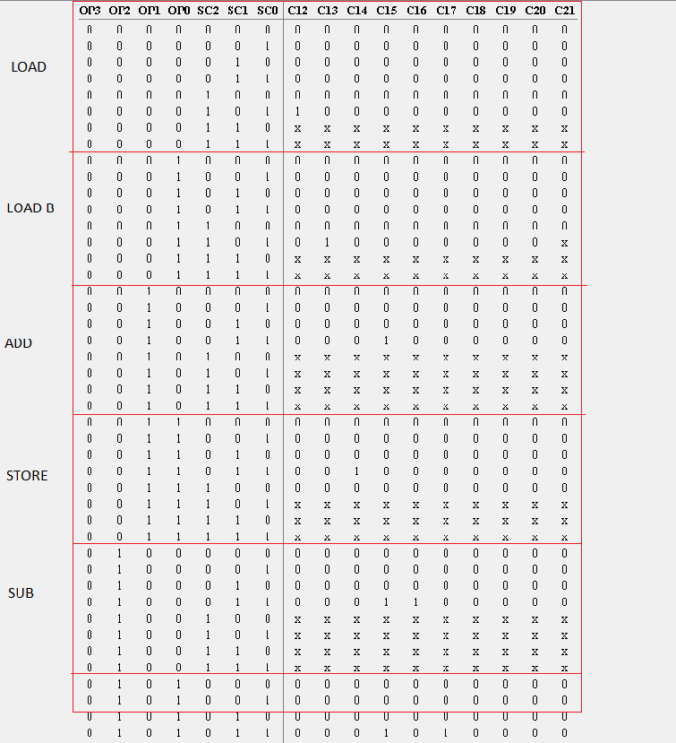

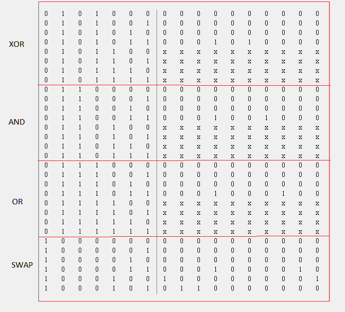

Table 6: Control Unit Table for Output pins C12 –
C21

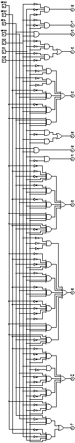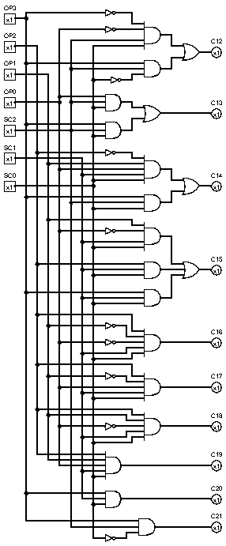

Figure 17:  Control Unit generated by Combinational
analysis after entering above table value on Logisim

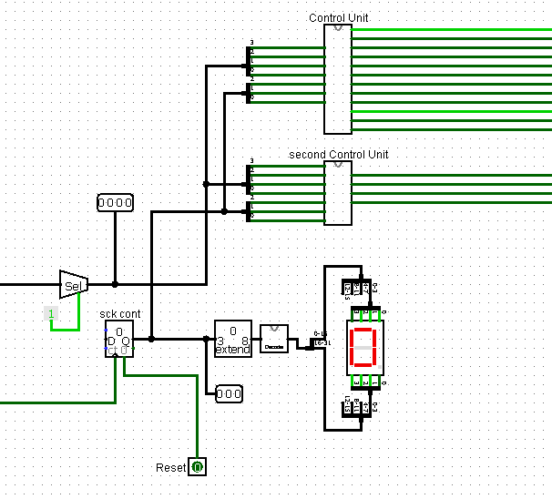

Figure 18: Design of Sequence Counter and Control
Unit

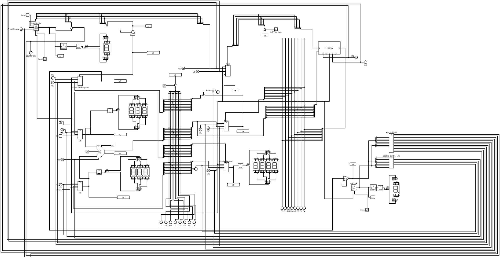

Figure 19: Whole CPU view in Logisim

---

## 3.9. ASSEMBLER 

An assembler is a program that takes basic computer
instructions and converts them into a pattern of bits that the
computer's processor can use to perform its basic operations

Its working principle is relatively simple. When
running assembler it expects filename as an argument. The file provided
is opened and read till the end. The escape character newline “\n” is
used to split and store an array of lines. Those lines are again split
with respect to &lt;SPACE&gt; and mapped into its uppercase form.

Arrays of strings are now ready for pattern matching.

Each index has a vector(fancy name for array that is
dynamically sized). 

Our instruction has 3 main formats

- \[OPCODE, REGISTER , ADDRESS\]
- \[OPCODE, ADDRESS\]
- \[OPCODE\]

These instructions are separated through rust pattern
matching features and then converted into equivalent hex For example the
code

LOAD A 1100 =&gt; 0000 1100 =&gt; 1c

LOAD B 1101 =&gt; 0001 1101 =&gt; 1d

ADD  =&gt; 0010 0000 =&gt; 20

STORE 1100 =&gt; 0011 1100 =&gt;3c 

Assembler written in Rust:

use std::fs::File;

use std::io::Write;

use std::fs::OpenOptions;

use std::io::prelude::\*;

use std::io::{Read, Seek};

use std::path::Path;

 

 

fn main() {

   
let arg = std::env::args().nth(1).expect("Enter
file");

   
let path = Path::new(&arg);

 

   
let mut file = OpenOptions::new().read(true).open(path).expect("couldn't
open file");

   
let mut buf = String::new();

   
file.read\_to\_string(&mut buf).unwrap();

 

   
let mut tokenized\_by\_line = buf.split("\\n").collect::&lt;Vec&lt;&str&gt;&gt;();

 

   
println!("{:?}", tokenized\_by\_line);

   
let tokenized\_form = tokenized\_by\_line.iter().map(|&val| {

       
val.split(" ").map(|x| String::from(x.to\_uppercase())).filter(|x| x != "").collect::&lt;Vec&lt;String&gt;&gt;()

   
}).collect::&lt;Vec&lt;Vec&lt;String&gt;&gt;&gt;();

   
let mut hex\_codes: Vec&lt;u8&gt; = Vec::new();

 

 

   
for (i,tokens) in tokenized\_form.iter().enumerate() {

       
match &tokens\[..\] {

           
\[OP, REG, ADDR\] =&gt; {

               
match &OP\[..\] {

               
"LOAD" =&gt; {

                   
let digit = u8::from\_str\_radix(&ADDR\[..\],2).expect("LOAD
needs a address and the address you provided is not
valid");

                   
match &REG\[..\] {

                       
"A" =&gt; {

                           
hex\_codes.push(0b000);

                           
hex\_codes.push(digit);

                       
},

                       
"B" =&gt; {

                           
hex\_codes.push(0b0001);

                           
hex\_codes.push(digit);

                       
}

                       
\_ =&gt; {

                           
panic!("unknown
register. Available Register are A and B on Line
{}", i);

                       
}

                    }

                }

               
"LDI" =&gt; {

                   
let digit = u8::from\_str\_radix(&ADDR\[..\],2).expect("LDI
needs a address and the address you provided is not
valid");

                   
match &REG\[..\] {

                       
"A" =&gt; {

                           
hex\_codes.push(0b1001);

                           
hex\_codes.push(digit);

                       
},

                       
"B" =&gt; {

                           
hex\_codes.push(0b1010);

                           
hex\_codes.push(digit);

                       
}

                       
\_ =&gt; {

                           
panic!("unknown
register. Available Register are A and B on Line
{}", i);

                       
}

                    }

                }

               
\_ =&gt; { panic!("unknown
OPCODE on line
{}", i);}

            }

            }

           
\[OP,REG\] =&gt; {

             
 match &OP\[..\] {

               
"STORE" =&gt; {

                   
let digit = u8::from\_str\_radix(&REG\[..\],2).expect("STORE
needs a address and the address you provided is not
valid");

                   
hex\_codes.push(0b0011);

                   
hex\_codes.push(digit);

                }

               
\_ =&gt; {

                   
panic!("unknown
OPCODE on line
{}", i);

                }

               }

            }

           
\[OP\] =&gt; {

               
match &OP\[..\] {

                   
"ADD" =&gt; {

                       
hex\_codes.push(0b0010);

                    }

                   
"SUB" =&gt; {

                       
hex\_codes.push(0b0100);

                    }

                   
"XOR" =&gt; {

                       
hex\_codes.push(0b0101);

                    }

                   
"AND" =&gt; {

                       
hex\_codes.push(0b0110);

                    }

                   
"OR" =&gt; {

                       
hex\_codes.push(0b0111);

                    }

                   
"SWAP" =&gt; {

                       
hex\_codes.push(0b1000);

                    }

                   
"CLEAR" =&gt; {

                       
hex\_codes.push(0b1000);

                    }

                   
"INC" =&gt; {

                       
hex\_codes.push(0b1000);

                    }

                   
"COMPLEMENT" =&gt; {

                       
hex\_codes.push(0b1000);

                    }

                   
"SHL" =&gt; {

                       
hex\_codes.push(0b1000);

                    }

                   
"SHR" =&gt; {

                       
hex\_codes.push(0b1000);

                    }

                   
\_ =&gt; {

                       
panic!("unknown
OPCODE on line
{}",i);

                    }

                }

               
hex\_codes.push(0b0000);

            }

           
\[\] =&gt; { }

           
\[..\] =&gt; {

               
panic!("unexpected
Instruction on line
{}", i);

            }

        }

    }

   
println!("{:?}",tokenized\_form);

   
println!("{:?}",hex\_codes);

 

   
let mut new\_file = OpenOptions::new().create(true).write(true).open(path.with\_file\_name(path.file\_stem().unwrap())).expect("no
file");

   
writeln!(&mut new\_file, "v2.0
raw");

   
for (i,hex) in hex\_codes.iter().enumerate() {

       
write!(&mut new\_file,"{:x}", hex);

       
if (i+1) % 2 == 0 {

           
write!(&mut new\_file," ");

        }

    }

}

# Chapter 4: CONCLUSION

Designing an 8 bit CPU was a choice I took so that the
architecture becomes easier to understand. Although a bit different than
how it's shown on slides, the computer has been implemented and for that
understanding of computer organization and architecture was necessary.

Since the whole computer was built in Logisim. Logisim
needs to be installed on the device and the computer’s CIRC file needs
to be loaded. In any text editor program can be written, and then
assembler can assemble it into a format that can be loaded in Logisim.
On Logisim click on RAM and then open the assembled file. Once the
master clock is activated the program will run. 

