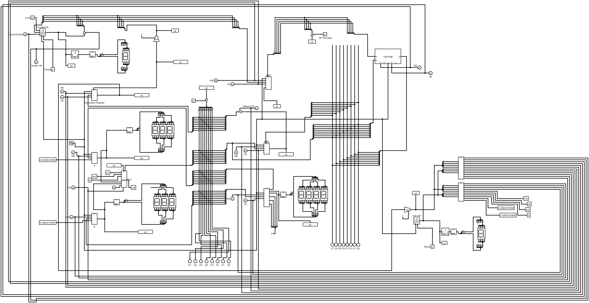

# Simple 8 Bit Computer

#### 

- 8 bit CPU architecture 
- 16 different instructions based on the suitability of our
- Our computer has a 4-bit opcode, 4-bit address length. 
- A memory of 16x8.
- Eight registers: IR, PC, A, B, OR, MBR, MAR and SC.
- Binary to 7 Segment converter
- An 8-bit internal Bus.
- 4-bit and 8-bit External Bus.

